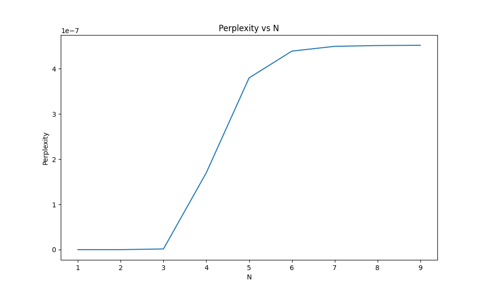
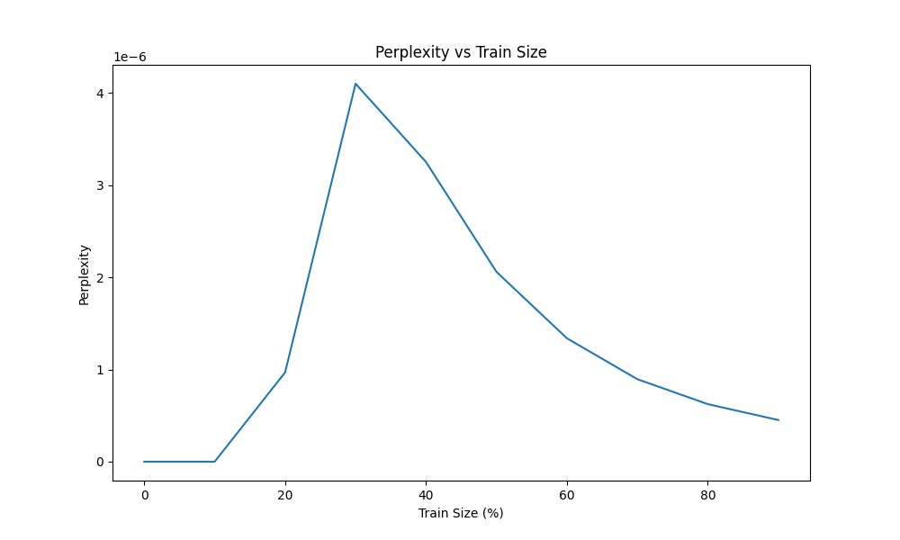
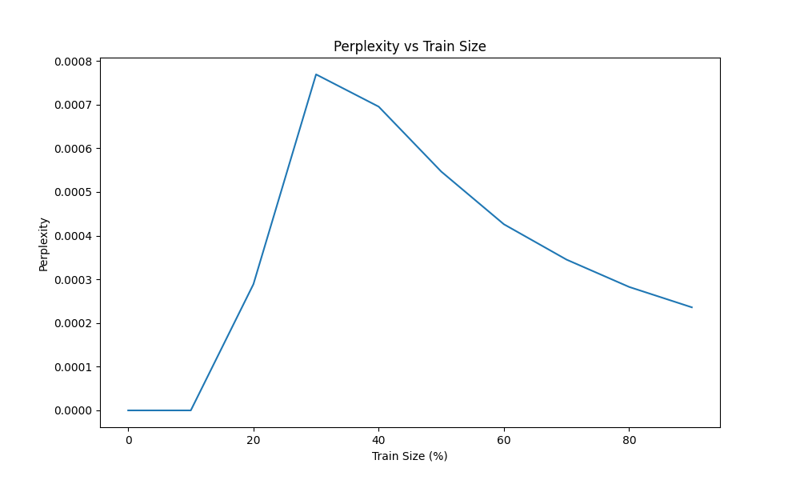

```{r setup, include=FALSE}
knitr::opts_chunk$set(echo = TRUE)
library(ggplot2)
```

# Introducción

Este trabajo implementa un modelo de lenguaje basado en n-gramas, entrenado con scripts de la serie Friends. El objetivo es generar texto nuevo que mantenga características del corpus original, analizando la calidad y coherencia de los resultados obtenidos con diferentes configuraciones del modelo.


\newpage


# Corpus y Preprocesamiento

1. Conseguir y limpiar un corpus de textos

Para el trabajo se eligieron dos corpus, ambos de series Sitcoms. El primero es el corpus de la serie Seinfeld (https://github.com/luonglearnstocode/Seinfeld-text-corpus), y el segundo es el corpus de la serie Friends (https://www.kaggle.com/datasets/blessondensil294/friends-tv-series-screenplay-script). Ambos corpus fueron limpiados de caracteres especiales y se les aplicó un preprocesamiento específico para scripts, que incluye:

## Corpus de Seinfeld

El corpus de Seinfeld contiene los guiones de los episodios de la serie. Es un solo archivo de texto que contiene los diálogos de todos los episodios, alrededor de 65.000 líneas. Aunque contiene algunas separaciones por episodio, no es un corpus estructurado jerárquicamente.

Para la experimentación del punto 3.1 se requirió mas textos para n-gramas de orden superior, por lo que se decidió utilizar el corpus de Friends.

## Corpus de Friends

El corpus de Friends contiene los guiones de todos los episodios de la serie. Por cada episodio de cada temporada se contiene un archivo de texto con la estructura de guión de la serie. Cada archivo contiene los diálogos de los personajes, separados por líneas y con marcadores de inicio y fin de episodio, escena y línea de diálogo.

## Preprocesamiento y Tokenización

El modelo implementa un preprocesamiento específico para scripts, que incluye:

1. **Tokens Especiales**:
   - `<e>`, `</e>`: Marcadores de inicio y fin de episodio
   - `<s>`, `</s>`: Marcadores de inicio y fin de escena
   - `<l>`, `</l>`: Marcadores de líneas de diálogo

En el caso del corpus de Seinfeld, solo se utilizó el marcador de fin de línea de diálogo `</l>` por cada linea del corpus.

Este preprocesamiento nos permite:
- Mantener la estructura jerárquica del script (episodios → escenas → diálogos)
- Generar texto que respeta el formato de guión
- Capturar patrones de inicio y fin de escenas/episodios
- Preservar el contexto conversacional entre personajes


# Implementación del Modelo N-gramas

El modelo implementa tres funcionalidades principales:

## 1. Construcción del Modelo

El proceso de construcción del modelo incluye:

## 2. Predicción y Generación

El modelo puede generar texto a diferentes niveles:

- a) Generación de líneas individuales
- b) Generación de escenas
- c) Generación de episodios completos

## 3. Control de Generación

El modelo incluye varios parámetros para controlar la generación:

- **Temperature**: Controla la aleatoriedad de la generación
  - T < 1: Más determinístico, selecciona palabras más probables
  - T > 1: Más aleatorio, aumenta la probabilidad de palabras menos comunes

- **Límites de longitud**:
  - `max_length`: Longitud máxima de líneas individuales
  - `max_sentences`: Número máximo de líneas por escena
  - `max_scenes`: Número máximo de escenas por episodio

## Ejemplo de Uso

```python
# Inicializar y entrenar modelo
model = Ngram(n=3)
model.fit(train_corpus)

# Generar una línea de diálogo
new_line = model.generate(context="Joey: Hey", temperature=1)

# Generar una escena
new_scene = model.generate_scene(
    context="[Scene: Central Perk] \n", 
    temperature=0.5, 
    max_sentences=100
)

# Generar un episodio completo
title = "The One with the "
episode = model.generate_episode(
    context=title, 
    temperature=0.4, 
    max_lines_per_scene=100
)
```

\newpage

# Resultados y Análisis

## Calidad de Textos Generados

Analizamos cómo varía la calidad de los textos generados en función del valor de $n$ y la cantidad de datos de entrenamiento.

Por un lado podemos hacer un análisis cualitativo de los textos generados. En general, observamos que para los valores de:

- n=1: Palabras aleatorias sin contexto
- n=2: Pares coherentes pero sin estructura global
- n=3-4: Mejor balance entre coherencia local y estructura
- n>4: Sobreajuste, repite fragmentos exactos

En un análisis cuantitativo, podemos medir la calidad de los textos generados con métricas automáticas como Perplexity o BLEU.






En los gráficos se observa que a medida que aumenta el valor de $n$, la Perplexity crece también. Esto se debe a que el modelo se ajusta demasiado a los datos de entrenamiento, perdiendo capacidad de generalización.

Además podemos ver que a medida que agrandamos la cantidad de datos de entrenamiento, la Perplexity parece aumentar inicialmente y luego disminuir. Esto puede deberse a que con más datos el modelo puede aprender mejor algún patron del lenguaje, pero también aumenta el riesgo de sobreajuste.

## Ejemplos de Textos Generados - Seinfeld

Para diferentes temperaturas generamos textos que comiencen con "jerry" (Seinfeld) para comparar la calidad de los textos generados (n=5).

### **T=0.3**

Texto muy determinístico en el comienzo de los, repite fragmentos exactos. Fijación en la expresión "i don't know". Muy variado a la larga.

-  `i don't know what to do so i put it in a garage.`
-  `i don't know.`
-  `you know i don't get you seinfeld. you want something one day. the next day you don't have to do this! this guy is waiting in my house.`
-  `i don't know what to do. so i just stood there like - remember how quayle looked when benson gave him that kennedy line? that's what i looked like.`
-  `i don't know.`

### **T=0.5**

Texto más variado, pero sigue repitiendo fragmentos como "i don't".

-  `george, here's the book. don't let anybody see it. don't let anything happen to it.`
-  `i don't understand it. i haven't read the manual. ooh!" you get my drift.`
-  `i don't know and i didn't want to talk to you. goodbye.`
-  `what's the matter?`
-  `oh, i don't know. i can't think of any solution,` 
`unless of course they should meet with some unfortunate accident. what do you think of this shirt?`

### **T=1.0**

Texto más parecido al corpus

-  `all right, look, we're late. thank you very much...`
-  `ah, you're better off. now you can just let it go.`
-  `you think you can handle that, numb nuts?`
-  `ah..........`
-  `would you?`

### Generación de Guión Generando Lineas de Dialogo

Un caso de uso curioso es generar varias lineas de dialogo y encadenarlas. En el caso de Seinfeld, por la naturaleza del programa de televisión, algunos ejemplos de generaciones podrían pasar por dialogo extraído de una escena del estilo de la serie.

```
postal worker danny: why start now?
jerry: you don't understand, i haven't been together with rachel for like three weeks. 
first i was on the road, then my parents show up, i'm getting a little uncomfortable 
jerry: hi. can i use your place? i got a bunch of friends coming over this weekend.
george: yeah my parents have it. sometimes it skips a generation.
salesman: (angry) all you people with hair think you're so damn superior! 
you have no idea how sick i am of running around town looking for socks.
```

Cuando comparamos esto con lineas del corpus, pudimos hallar las siguientes:

- `POSTAL WORKER DANNY: Why start now?`
- `JERRY: You don't understand, I haven't been together with Rachel for like three weeks. First I was on the road, then my parents show up, I'm getting a little uh backed up.`
- `GEORGE: Yeah my parents have it. Sometimes it skips a generation.`
- `SALESMAN: (angry) All you people with hair think you're so damn superior!` 
`You have no idea what it's like. You ever look down in the bottom of your tub and see a fist` `fulla hair? How'd you like to start your day with that?! (looks ready to punch Jerry)`

En algunos casos se repitió gran parte de una linea del corpus, sin embargo aquellas partes que no son repetidas parecieran tener coherencia en la misma linea. Y por esto mencionado de la forma de dialogo en la serie, las lineas juntas podrían ser un dialogo de la serie en sí. 

## Ejemplos de Textos Generados - Friends

Cuando repetimos el mismo experimento con el corpus de Friends, observamos resultados similares.

### **T=0.3**

Texto muy determinístico, repite fragmentos exactos, exactamente igual que en Seinfeld dos veces figura "i don't know". Otras dos veces figura "oh my god". La frase "sitting on the couch" se repite 3 veces textual en una de las generaciones. Cuando diverge del n-grama mas probable, varía mucho la generación.

-  `well, i was hoping after tonight that maybe i could you know…`
-  `i don't know, but uh, did you guys wrestle?`
-  `oh my god, you’re right! i am too late; they’re sitting on the couch and ross is sitting on the couch and ross is sitting on the couch a`
-  `oh my god, it's all so elegant! when's the dirty stuff starting?`
-  `i don't know, but i.. look, even if she shoots me down, at least i won't spend the rest of my life with you.`

### **T=0.5**

Texto más variado nuevamente, en este caso pasa a repetir "all right".
-  `all right.`
-  `all right, i guess i'll have my stuff packed up.`
-  `well, i was thinking that maybe we could go on a date with jean-claude van damme. can you beat up that guy?`
-  `so you're ruling out surrogacy?`
-  `yeah, i know exactly what i’m talking about.`

### **T=1.0**

Texto más parecido al corpus.
-  `wow, that’s in like 20 minutes. you’d better get dressed.`
-  `it was, yeah. i kind of don't want it to be amazing.`
-  `yeah. listen uh, i’d prefer it if you didn’t call me joey. since i don’t know anyone here, i thought it’d be cool to try out a cool work nick`
-  `you call that delicious?`
-  `uh well yeah, that was the plan, but by the time i was 31!`

En el caso del corpus de Friends, lo que podemos realizar es escribir escenas completas.

## Ejemplo de Escena Generada - Friends

Podemos comenzar una escena por ejemplo con "[Scene: Central", y el modelo completará la escena.

```
    [Scene: Central perk, chandler and monica are sitting on the couch as rachel enters.]
    chandler: no, you keep the old ones in the back, that is so sweet! 
    oh, i can’t believe it! make the presents! make the presents!
    rachel: you know what i don't have?
    monica: the fuzzy little mints at the bottom of the page. 
    then again, maybe it isn't and it's just ridiculous, 
    and it's like, it's like, all of a sudden my roommate, rachel.
    rachel: oh my god! that is our friend! (monica covers her eyes in shock.)
    monica: oh my god, what the hell is in that first kiss.
    rachel: oh my god.
    joey: oh yeah, no no no...that's great!
    ross: well, i guess i could break down your door.
```

A pesar de tener algo de "forma", las oraciones son generadas independiente por lo que no tienen sentido en conjunto.

### Ejemplo de Episodio Completo Generado - Friends

Adjuntamos en el anexo un ejemplo de episodio completo generado por el modelo, comenzando con el título "The One with the", como suelen nombrarse los episodios de Friends. Al igual que lo observado en las escenas, las líneas de diálogo generadas no tienen coherencia entre sí, y la trama del episodio entre las escenas es incoherente también.

## Análisis del Grado de Creatividad e Inteligencia

### Grado de Creatividad

El modelo exhibe un grado de creatividad fundamentalmente limitado y superficial, que podemos analizar en tres niveles diferentes:

1. **Creatividad Combinatoria**
Es capaz de generar nuevas combinaciones de frases y expresiones que no existen exactamente en el corpus original. Por ejemplo, puede crear diálogos entre personajes que nunca ocurrieron en la serie, como interacciones entre Joey y Phoebe que mantienen sus personalidades características pero en situaciones nuevas. Sin embargo, estas combinaciones son puramente estadísticas, basadas en la frecuencia de aparición de patrones en el corpus de entrenamiento. En términos de creatividad combinatoria, el modelo alcanza un grado medio de desempeño. 

2. **Creatividad Estructural**
Si bien puede reproducir la estructura básica de un guión de Friends, con sus marcadores de escena y diálogos, no es capaz de crear nuevas estructuras narrativas. El modelo está confinado a los patrones estructurales presentes en el corpus de entrenamiento, sin poder innovar en la forma de contar historias o presentar diálogos. Esto se evidencia en cómo tiende a caer en patrones repetitivos y estructuras conversacionales predecibles. La creatividad estructural del modelo es baja.

3. **Creatividad Conceptual**
No puede generar ideas o conceptos verdaderamente nuevos, ni crear tramas originales coherentes. Aunque puede reproducir el estilo humorístico de Friends, no comprende realmente el humor que está generando. Es particularmente notable cómo el modelo puede reproducir chistes o situaciones cómicas similares a las del corpus, pero no puede crear humor original que requiera comprensión contextual o timing. En cuanto a la creatividad conceptual, el modelo muestra un grado muy bajo.

### Grado de Inteligencia

La "inteligencia" del modelo se manifiesta de manera desigual en diferentes aspectos:

1. **Inteligencia Lingüística**
Demuestra competencia en el manejo de la estructura básica del lenguaje y es particularmente efectivo en reproducir el estilo conversacional característico de Friends. Sin embargo, esta competencia es superficial: el modelo no comprende realmente el significado de lo que genera, como se evidencia en las frecuentes contradicciones semánticas y la falta de coherencia en conversaciones extensas. En este ámbito podríamos decir que el modelo alcanza un grado medio-bajo. 

2. **Inteligencia Narrativa**
No puede mantener coherencia en historias largas ni establecer relaciones causales lógicas entre eventos. Un ejemplo claro es cómo el modelo puede comenzar una escena con una premisa específica pero rápidamente pierde el hilo narrativo, derivando en diálogos inconexos o contradictorios. La incapacidad de planificar el desarrollo de una trama demuestra las limitaciones fundamentales del enfoque basado en n-gramas. Para este caso el modelo tiene un grado muy bajo.

3. **Inteligencia Social**
Puede reproducir interacciones sociales básicas y mantener ciertos aspectos de las personalidades de los personajes, como el sarcasmo de Chandler o la ingenuidad de Joey. Sin embargo, no comprende realmente las relaciones entre los personajes ni puede generar interacciones que reflejen un entendimiento profundo de sus dinámicas sociales. Para este caso el modelo tiene un grado bajo.

### Conclusión sobre Creatividad e Inteligencia

El análisis de este modelo n-grama revela las limitaciones fundamentales de los enfoques puramente estadísticos para generar lenguaje. Si bien puede producir texto que superficialmente parece creativo e inteligente, un análisis más profundo revela que carece de las características fundamentales que definen la verdadera creatividad e inteligencia humana.

La aparente creatividad del modelo es en realidad un producto de la recombinación estadística de patrones existentes. No puede generar ideas verdaderamente nuevas ni comprender el significado más profundo de lo que produce. De manera similar, su "inteligencia" se limita a reconocer y reproducir patrones, sin verdadera comprensión o capacidad de razonamiento.

Estas limitaciones subrayan la diferencia fundamental entre la capacidad de procesar y recombinar información existente, y la verdadera creatividad e inteligencia que implican comprensión, intencionalidad y capacidad de innovación. El modelo n-grama, aunque impresionante en su capacidad de imitar ciertos aspectos del lenguaje humano, permanece fundamentalmente como una herramienta estadística sofisticada, lejos de alcanzar niveles de creatividad e inteligencia comparables a los humanos.

\newpage

# anexo

## Episodio Completo Generado - Friends


### The One with the fertility test
- `phoebe: yeah, i think it was better when you guys were sad. hey, uh, remember the roller blades?`
- `phoebe: oh no, ooh, ooh, did somebody forget to use a coaster?`
- `monica: oh my god, oh my god, that letter is gonna go in our file! we're never gonna get a kid. no, we're gonna be one of those old couples ross: i just wanna say good-bye to you guys and to see if you guys will place a little bet for me, huh? twenty bucks on black 15.`
- `joey: i don’t know! but it’s the same!`
- `ross: i don't know. what's in this pie?`
- `monica: i know, i just thought it would be fun.`
- `monica: oh, i already have one.`
- `phoebe: oh my god! (walks to the window) go away! (gesturing.) stop looking in here!`
- `joey: i know, but i’m a neurologist. and just to be on the safe side, dr. wells wanted a more comprehensive overview of you status so he sent me.`
- `rachel: oh, i know, i know, it’s-it’s so, it’s so totally like, "whoa! can we do this?" y’know, i mean, but i mean it just feels right! don’t you think? rachel: i got off the plane.`
- `monica: i don’t know exactly. it’s-it’s sorta like wrestling.`
- `chandler: i don’t think so.`
- `rachel: oh my god! you got her to stop crying!`
- `rachel: and i also brought my friend joey…`
- `joey: i don't know. who'm i'm married to?`
- `chandler: so you’re just, kinda rubbing it on yourself?`
- `phoebe: i love you guys.`
- `chandler: i am pretending.`
- `chandler: well that’s not fair, you’ve already had some!`
- `chandler: well you did pull his hair.`
- `ross: i love this. (he got a sweater)`
- `phoebe: okay, i didn’t understand that, but y’know, maybe that’s ‘cause you were speaking the secret language of love!`
- `joey: i don’t know! but he did not eat your face cream!`
- `chandler: you got it. good woman! (the waiter turns around, it's a man) could we get a bottle of your most overpriced champagne?`
- `rachel: oh my gosh, joshua!`
- `monica: i think i feel ok about it. actually i think i feel really good about it.`
- `monica: well, i guess we've established who's staying here with monica...`
- `chandler: i am here, on my knees, holding up these couch cushions as a symbol of my sorrow and regret, much like they did in biblical times. though you may monica: i’m sorry, they surprised me. there was nothing i could do!`
- `phoebe: oh my god, we killed bob!`
- `joey: yeah, i called the lady about that. i told her i was just joking. she was pretty nice about that.`
- `rachel: you think you’re gonna get out of this on a technicality?`
- `chandler: okay, i gotta ask, who calls us that?!`
- `rachel: oh, i gotta get my ticket!`
- `joey: no, i didn’t!`
- `phoebe: i don’t know. you could tie her up, she could tie you up; you could eat stuff off each other…`
- `rachel: you know what else i’m not gonna miss? "i’m monica. i wash the toilet 17 times a day. even if people are on it!"`
- `chandler: i can't believe you did this. (walks toward the door)`
- `rachel: i don’t know, i don’t know. urrrgh! look, maybe we should take a break.`
- `phoebe: i got no sleep last night!`
- `monica: oh, you can't show phoebe this! she hates those corporate massage chains.`
- `rachel: oh, i know, isn't she?`
- `chandler: i don't know. maybe we can open this up somehow.`
- `rachel: oh my god, look-look he’s taking off her clothes!`
- `rachel: oh, i am sorry...`
- `joey: i don’t know, it smells good.`
- `phoebe: yeah, i know! (turns to chandler) so, what do you think?`
- `l> rachel: what?`
- `chandler: well you coulda tried, not kissing him.`
- `rachel: what is the matter with you?!`
- `monica: you wanna fool around with joey?`
- `joey: (to chandler) you're fake laughing too, right?`
- `chandler: okay, here is the thing. we have thrown a very formal surprise party for you in there! all of your friends are in there and your parents!`
- `monica: i don’t believe this! wow, look at this refrigerator! it’s gigantic! i mean i could live in this thing! i’d be cold, but i’m always cold. oh my god, monica: (to chandler) rachel's at work.`
- `chandler: all right, there’s a nuclear holocaust, i’m the last man on earth. would you go out with me?`
- `chandler: well, i don’t have to buy that, "i’m with stupid" t-shirt anymore.`
- `rachel: what are you talking about, ross, you just said that you read it twice! look, y'know what, either it does or it doesn’t, and if you have to even joey: (looking at the flyer) yeah-eah! 200 dollar reward, split five ways!!`
- `joey: i know. i know. and she’s not only my friend; she’s my pregnant friend! she’s my pregnant friend who’s ross’ ex!`
- `rachel: oh my god! you guys this is so great! i mean it's so unexpected! i mean chandler's birthday is even before mine!`
- `ross: oh, i see, somebody is afraid of a little competition with the ladies?`
- `phoebe: okay, i think i need to do some shopping. (gets up and leaves.)`
- `rachel: oh, i know, i know, the odds are against us, but somebody has to win, and it could be us! and then how you gonna feel? you know, we're chandler: i don’t think the contestants are supposed to speak to each other.`
- `rachel: well, i was going to, but then i figured, you know... you're food is so delicious and perfect, you can never have too many of those pumpkin things.`
- `ross: i don’t know, i told her it was stupid to put off the wedding just because the hall was gone and she liked flipped out.`
- `phoebe: you wanna be on my list too? keep talking! has anyone seem my list by the way?`
- `chandler: oh my god!`
- `joey: oh my god.`
- `chandler: well maybe he was nervous.`
- `rachel: i know. i know. i panicked, i panicked. i didn’t want him to start yelling at me like i was some ’74 latour.`
- `phoebe: you know like... uh okay... uh... 'could that report be any later?'`
- `joey: oh, i don’t know.`
- `rachel: well, i haven’t discussed it with him yet, but i know he’s gonna be relieved. last week, he brought this girl over and i started talking to her about chandler: oh my god.`
- `rachel: oh my god! i’m gonna have to find another minister.`
- `phoebe: oh my god! (joey looks at her.) i’m sorry, too soon. you go.`
- `rachel: i know!`
- `rachel: oh my god! oh my god! oh chandler!! (hugs him.) you guys are gonna be so happy!`
- `rachel: oh my god, phoebe, are you gonna go to jail?!`
- `ross: no, no, no, you can't take the remote control!`
- `joey: oh, i don’t know.`
- `chandler: i don't think so.`
- `phoebe: well, i think i can help you get over him.`
- `phoebe: well, i mean, i'm not married married, ya know, he's just a friend and he's gay and he's just from canada and he just needed a green card.`
- `phoebe: i don't know what to do with that.`
- `chandler: you know, i don't think we brought enough stuff. did you forget to pack the baby's anvil?`
- `joey: oh, i don’t know.`
- `joey: yeah, i guess it is. and so… i’m gonna get on this spaceship, (smoke starts pouring in from the ceiling, and a ladder comes down, with flashing, colored lights rachel: i didn’t see anything! i actually changed my mind about the name.`
- `ross: you know, i really don't want to get involved in you guy's relationship.`
- `joey: i don’t know. i like her, you know. she’s different. there’s uh, somethin’ about her.`
- `joey: oh, i don’t know.`
- `ross: oh, i see, somebody is afraid of a little competition with the ladies?`
- `joey: i was afraid of that.`
- `chandler: i don't know. maybe.`
- `l> rachel: i don’t know, i don’t know. urrrgh! look, maybe we should take a break.`
- `rachel: oh my god! you look so beautiful!`
- `ross: i can't believe you hated me.`
- `joey: oh, i don’t know.`
- `chandler: oh, that’s parent’s day, first grade. that’s me with the janitor martin.`
- `monica: what are you talking about?`
- `joey: oh my god! you did too? it totally freaked me out, what was that?!`
- `ross: i don't know. soap?`
- `rachel: you don't want to work for a guy like that.`
- `joey: uh, i get leslie out of the coma and then we make out.`
- `rachel: oh my god! this is it! (she and phoebe hold hands.) (to phoebe) i really hope it’s you!`
- `monica: i can’t believe we’re living here!`
- `chandler: i don’t want to say.`
- `chandler: you are so great! i love you!`
- `monica: i knew that! rachel! use you’re head!`
- `ross: y'know what? i'm really not in the mood.`
- `rachel: oh my god! oh my god!!`
- `phoebe: oh, i love paper mache! what did you make?`
- `chandler: yeah, i don't think he's up to meeting everyone yet.`
- `joey: i don’t know! maybe she’s crazy! (storms out.)`
- `joey: all right, all right, all right, all right, you really wanna know how i did it, i’ll show ya. when you handed me back the card, what you didn’t joey: i don't know. but i can see through your sheet. (he looks out the window.) yeah, yeah, that's her. but y'know what? doesn't matter, i'm never gonna get to be continued`
- `joey: hey, this isn't about juice anymore, alright man.`
- `ross: you weren't trying to entice me with your nakedness.`
- `rachel: oh, i don't know. i don't know.`
- `monica: i can't believe you let them win!`
- `phoebe: okay, so what do you think ladies? who wouldn’t be interested? who wouldn’t want to date him?`
- `chandler: i don't know. that's the thing. i don't know what i want to do. i just know i'm not going to figure it out working there.`
- `chandler: i don't know. except that, for one last time... (he touches the players as he says the following) good game, good game, good game, good game, good game, good chandler: i don't know. it's a bracelet.`
- `phoebe: oh my god! you dated someone with a glass eye too?!`
- `ross: you know what, if you wanna look for a house, that's okay.`
- `chandler: oh, i think this is the episode of three's company where there's some kind of misunderstanding.`
- `ross: i don't know, but when i spoke to her, she said she had already passed the mucus plug.`
- `joey: yeah, i know, i sleep in the next room.`
- `rachel: oh, i gotta get my ticket!`
- `ross: well, i think it's perfect. y'know, it's just gonna be the two of us, she spent all day taking care of my monkey...`
- `ross: oh, you know what? you're gonna get it. i-i-i-i can feel it.`
- `chandler: well maybe it was all of your questions.`
- `ross: no, no, i just have to talk to someone.`
- `monica: oh my god, this is horrible!`
- `rachel: oh, i think i saw some in here.`
- `rachel: well, i have to say that earns tutu pieces of candy.`
- `rachel: okay, fine. (she gets up and walks into her bedroom)`
- `chandler: okay, but don't you think this is a little extreme?`
- `ross: okay, i have a problem i have to go into work for a few hours, some kids messed up the homo sapien display.`
- `ross: i don’t know, i-i was all high.`
- `rachel: oh my god! oh my god! oh chandler!! (hugs him.) you guys are gonna be so happy!`
- `rachel: well, i was kinda supposed to be headed for aruba on my honeymoon, so nothing!`
- `l> chandler: okay.`
- `joey: yeah, i think that'd be best... so, so i'm gonna... i'm gonna take off...`
- `phoebe: oh my god! you dated someone with a glass eye too?!`
- `monica: okay, i'd like to know how much the room was because i'd like to pay my half.`
- `ross: no, no, no. the next time it's gonna be a hawaii at sunset. [pause] but maybe the time after that!`
- `monica: i can’t believe we’re living here!`
- `phoebe: i don't know! i don't remember!`
- `ross: no, no, no, you cannot go to dinner with him.`
- `joey: no that’s not what i was going to say at all. no, what i was going to say is when you’re 90 you’ll still have the memory of what rachel: oh, i gotta get my ticket!`
- `joey: i don’t know. i might stay there for a few days while i look for an apartment.`
- `ross: oh, i see, so everybody wins.`
- `monica: i am not wrong.`
- `rachel: oh my god! it sure didn’t look this way when i lived here.`
- `rachel: i know, i know, i know, i know. i was just thinking about when they were there the last time, i'm sorry. i'm sorry, i'm sorry. ok, ok, look, rachel: well, i usually go... play tetris on somebody else's computer.`
- `monica: oh my god! ross, you wouldn't believe the cute little noises the twins are making. listen.`
- `phoebe: oh my god! so was she! oh, i’ve got-i’ve got goose bumps. (she holds out her arm.)`
- `monica: you know what this is, this is us getting ready for the prom.`
- `phoebe: oh my god, has she slept at all?`
- `monica: oh my god! you own an italian restaurant and you think that tastes good?! where are you even from?`
- `monica: i thought i was making headway, everyone was smiling at me all day, i get off work and i find out that they wrote this (puts on her chef chandler: i don't know. but i know i'm not afraid to do this.`
- `rachel: oh my god! you got her to stop crying!`
- `ross: oh my god!`
- `chandler: i don’t know what it is, i just can’t take a good picture.`
- `ross: yeah, well what about you? you weren't you know, so hot in college either. after everything he said, he'd go "ba dum bum chessh"`
- `joey: hey, hey, hey, hey! i'm not gonna mess with jack, he's a great man, he fought for our country.`
- `phoebe: i just wish they'd realise they should be together.`
- `rachel: oh my god, phoebe, that’s not ralph lauren. that’s kenny the copy guy.`
- `rachel: what?`
- `ross: i'm the holiday armadillo, your part-jewish friend. you sent me here to give ben some presents. remember?`
- `rachel: i don’t know, i don’t know. urrrgh! look, maybe we should take a break.`
- `chandler: i don’t know, y'know. what, what, would you do?`
- `rachel: oh, i don’t know. well maybe it’s just the idea of barry for the rest of my life. i don’t know i think i feel like i need to be continued`
- `rachel: oh my god! you guys this is so great! i mean it's so unexpected! i mean chandler's birthday is even before mine!`
- `monica: i can’t believe we’re here.`
- `rachel: well, i was going to, but then i figured, you know... you're food is so delicious and perfect, you can never have too many of those pumpkin things.`
- `joey: i don’t know. i might stay there for a few days while i look for an apartment.`
- `rachel: oh, i don't know. i guess it's not about no guys, it's about the right guy, y'know? i mean, with barry, it was safe and it was easy, but phoebe: yeah, i should probably take it back. ooh, but you know what? while i'm at the police station, i could check their ten most wanted lists because my friend joey: i think saturday—(groans in pain again).`
- `joey: (entering) hey!`
- `chandler: yes, but for the last time.`
- `ross: okay, okay. uh, well uh, rachel is going to need to yell sweet nothings (paul enters) in his ear.`
- `rachel: oh my god, look-look he’s taking off her clothes!`
- `monica: oh, i love this street. the trees, the big front yards, the actual picket fences.`
- `monica: really? wow, well then come on, i wanna show you how to fold the toilet paper into a point.`
- `rachel: oh, wait yes, but i can’t eat too much. paul is taking me out to dinner tonight, he said he has a big surprise planned.`
- `l> rachel: oh my god! did you get to see anything good?`
- `monica: i just told my mom i’d cater a party for her.`
- `ross: yeah, you too. man, so-so what are you up to?`
- `ross: what?`
- `chandler: i don’t think the contestants are supposed to speak to each other.`
- `ross: i know, i know, it's, it's almost...[turns around, sees chandler and joey] what do you say we go take a walk, just us, not them?`
- `monica: i don’t believe this! when someone asks you in for lemonade, and to you that means they wanna have sex?`
- `joey: i don't know. but hey, i know we can decide. okay, i'm gonna ask you questions and you answer real quick. okay?`
- `chandler: i am sorry, moment to make fun of that, please!`
- `phoebe: oh, i don't wanna choose! it's (rachel is walking by). oh okay, wait. rach! listen i have a very special bridesmaid task for you today.`
- `rachel: oh my god! i bet that’s him. my digital fairy tale is about to begin. i wonder how i should be? should i be uh (in a sexy voice) joey: hey, i see you guys already met, huh?`
- `joey: what are you talking about? it was a big deal. i mean, come on you can’t tell me last night didn’t mean something to you. i-i was there, you’re monica: i need a few more things to make the margaritas. uhh, i need some salt, some margarita mix, and tequila.`
- `chandler: i don’t know, y'know. what, what, would you do?`
- `rachel: phoebe, come on that's silly.`
- `phoebe: you know what, that's it, that's it. [she rips off the mits, ryan follows her lead.]`
- `ross: i don't get a goodbye?`
- `rachel: well, i was kinda supposed to be headed for aruba on my honeymoon, so nothing!`
- `rachel: oh, i don't know. i don't know.`
- `ross: no, no, no, no. tick, tick, tick, tick.`
- `ross: joey, you shouldn't lie on your résumé.`
- `rachel: oh my god! you guys this is so great! i mean it's so unexpected! i mean chandler's birthday is even before mine!`
- `joey: yeah, i guess it is. and so… i’m gonna get on this spaceship, (smoke starts pouring in from the ceiling, and a ladder comes down, with flashing, colored lights joey: i know, i know. and when they moved back in together, i figured y'know, that's where things were headed.`
- `ross: oh, i uh, i mean, i... dude, i spent the whole conference with charlie.`
- `joey: oh, i don’t know.`
- `phoebe: yeah, i know, but i don’t think that means anything.`
- `chandler: yeah, i think it is!`
- `chandler: i think it’s necessary. (backs away anyhow.)`
- `rachel: oh my god! you got her to stop crying!`
- `ross: what are you doing?`
- `phoebe: you mean the one that my grandmother made me swear on her deathbed that i would never let out of our family?`
- `joey: i don't know.`
- `rachel: oh, i gotta get back to work.`
- `phoebe: i don’t know.`
- `joey: i don't know. but hey, i know we can decide. okay, i'm gonna ask you questions and you answer real quick. okay?`
- `phoebe: oh my god, what's it doing here?`
- `monica: oh, y'know..`
- `chandler: i am so sorry. i really am. i was an idiot back then. i rushed the stage at a wham concert for crying out loud!`
- `rachel: oh, i really liked him. (looks at ross) yeah, it was really, really, really good.`
- `ross: i don't know you guys.`
- `chandler: i can't believe you got us into trouble. [slaps joey on the arm. joey takes exception and slaps him back]`
- `rachel: i don't know, i don't know.`
- `joey: well, i couldn't do it. i told her i didn't want to get the part that way.`
- `ross: i have to say tupolo honey by van morrison.`
- `rachel: i don't know, i don't know.`
- `joey: oh well, it’s not on tv yet.`
- `joey: oh my god, you’re back!`
- `joey: well, i was thinking about that and i, i think the best way would be, to not.`
- `l> rachel: oh, i know, i know. [turns on the tv. joey in on it.]`
- `monica: oh my god! ross, are you in england? was emily surprised?`
- `monica: well, i guess we've established who's staying here with monica...`
- `phoebe: oh, i was telling them about you and emily. y'know, try to get some sympathy.`
- `joey: yeah. and look, i just want you to know that with rachel staying here and everything, all my feelings from before are totally over, okay? and even if they joey: i don't know. but hey, i know we can decide. okay, i'm gonna ask you questions and you answer real quick. okay?`
- `rachel: i don't know, i just kinda ran into him last night.`
- `rachel: ok, i...`
- `ross: i think when someone steals your credit card, they've kind of already thrown caution to the wind.`
- `phoebe: oh, i don't wanna choose! it's (rachel is walking by). oh okay, wait. rach! listen i have a very special bridesmaid task for you today.`
- `rachel: oh my god! oh my god, look at these pelts!`
- `joey: i don’t know! but he did not eat your face cream!`
- `monica: you went out with wallis pincer?`
- `joey: i don’t know, it smells good.`
- `phoebe: oh, i don't know. i mean it was fun one time.`
- `joey: all right, i guess i can hold out a little longer. let's have a game.`
- `monica: no you robot!!`
- `ross: oh, i thought joey was here. five is good. (gunther leaves, hurt) well, i'm gonna have a loogie in my coffee tomorrow.`
- `rachel: oh, i gotta go back in there.`
- `rachel: oh my god.`
- `ross: what are you doing? we're going to a hospital.`
- `joey: i don't know.`
- `joey: oh my god! you did too? it totally freaked me out, what was that?!`
- `chandler: i don’t know, it’s these new shoes, they’re all slippery.`
- `monica: well, at least you scared someone.`
- `monica: i think it's totally insane, i mean, they work for the hospital. it's like returning to the scene of the crime. you know, i say we blow off the ross: i can't believe this. i can't believe this is happening. i have to give the keynote speech tomorrow! ok? i have to stand up in front of all these monica: i love you!`
- `chandler: so, you and rachel tonight, huh?`
- `monica: i think you're better than you think you are.`
- `rachel: oh yeah, it's fine, it's fine. sandy was just... was just telling me about how he proposed to his fiancée and it was just sooo beautiful.`
- `chandler: okay, but you should know he eats five times a day and shoves pennies up his nose.`
- `ross: yeah, i know, it's my birthday. we all should be here.`
- `joey: oh, all right, i can ask monica.`
- `monica: i love you. (they hug and kiss.)`
- `monica: oh my god! i love that!`
- `monica: oh my god! you still have the chipper!`
- `joey: well, i started building one. but then i decided to take it to the next step.`
- `chandler: okay, so richard, richard!`
- `phoebe: you know you should go outside and be with the three-dimensional people.`
- `chandler: well, i think you need to come out of your shell just a little.`
- `ross: i don’t know what to say, i’m sorry. though, you’re not supposed to take these. (points to the bone) it’s like a million years old, we, we actually, we only need six more people for a human pyramid...swoop!! swoop!!`
- `rachel: yeah, you do.`
- `rachel: oh my god! what if he thinks i'm the kind of girl that-that would just sleep with him?`
- `ross: i can't believe this. i was just being a good guy. i treated you with respect and understanding.`
- `joey: okay, what else?`
- `rachel: oh, i gotta go back in there.`
- `ross: (entering) hey!`
- `ross: okay, i know what i have to do. i’ve got to go red ross. (joey and phoebe don’t know what he’s talking about.) y’know, red ross!`
- `l> chandler: oh, i will. but i will need a mirror... as he is me!`
- `chandler: okay, there are no famous joey’s. except for, huh, joey buttafucco.`
- `phoebe: oh, i have dinner plans with joey. we get together about once a month to discuss the rest of you guys.`
- `chandler: i think i do! (they all laugh.) thank you, monica.`
- `joey: and i got custody of the kid, right? now suppose the kid dies and-and i gotta buy a new kid.`
- `ross: look, i didn't recognize it without that inflatable sheep.`
- `monica: i can't believe this, just like 2 weeks ago i was watching sudden death, now i'm on a date with jean-claude van damme. can you beat up that guy? phoebe: well, one of you has to take the first step! and it should be you, because she’s the one who’s leaving. it’s harder for her!`
- `joey: well, i only said that because of ross, you know. then i saw him kissing charlie...`
- `ross: yeah, that's how i know. i'm ross by the way.`
- `phoebe: i can’t believe i’m gonna have a party! this is so great! (really excited) a party! (really, really excited) yay!! (suddenly, she starts crying and rachel moves to comfort ross: oh, i thought you guys had just been on like four dates, i didn’t realise that had become anything, yet.`
- `ross: well, i guess i'm gonna call the beer company and try to find out where he is.`
- `monica: i can't believe this, just like 2 weeks ago i was watching sudden death, now i'm on a date with jean-claude van damme. can you beat up that guy? ross: i don't want to be single, okay? i just... i just- i just wanna be married again!`
- `ross: oh, i am sorry, did you not like her, because i was hoping that we could come to one of your kissing parties on`
- `phoebe: oh, i don't know. i mean it was fun one time.`
- `joey: i don't know. but i can see through your sheet. (he looks out the window.) yeah, yeah, that's her. but y'know what? doesn't matter, i'm never gonna get to be continued`
- `monica: oh, i wish i didn't have to wait to take a pregnancy test.`
- `rachel: oh my god! you look so beautiful!`
- `monica: so i made snacks. please, just hang out okay? i’m just gonna rest my eyes just a little bit.`
- `chandler: oh my god! that's why i got up too!`
- `phoebe: well, i think i broke it. but that’s all right, here’s the number you can call.`
- `monica: you are so sweet to notice! yes, i lost three and a half pounds!`
- `ross: okay, it’s not, it’s not.`
- `phoebe: i know, i know. [to rob] hello.`
- `chandler: hey, you just wanna forget about raquetball and hang out here?`
- `phoebe: i can't believe it. did you tell your board about how kids want to hear the truth?`
- `ross: i can't believe this. i was just being a good guy. i treated you with respect and understanding.`
- `ross: oh, i know. (laughs) y’know, just-just talking about it is getting me kinda…`
- `monica: oh my god! that’s my restaurant, i’m the chef there.`
- `ross: so i guess we’re back to uh, baby girl.`
- `joey: well, i think it went pretty well. i.. i got a callback for thursday.`
- `chandler: well, i didn't know how to tell you before, but... we got the house.`
- `joey: hey, you don’t even live here anymore! what are you doing answering my phone? i have my machine!`
- `ross: all right, i see what you guys are saying. i'll uh, i'll go downstairs and fill out an application.`
- `chandler: well, i can't say "hump" or "screw" in front of the b-a-b-y.`
- `phoebe: yeah, i saw the article on your coffee table and i memorized the title to freak you out!`
- `phoebe: yeah, well, i kinda thought.`
- `rachel: i know, i just didn't want to wear my glasses on my first date.`
- `rachel: oh, i know, i know, the odds are against us, but somebody has to win, and it could be us! and then how you gonna feel? you know, we're phoebe: okay, well umm, i know that we haven’t talked in a long time, but umm okay, our mom is not our birth mom. this-this other lady is our birth monica: oh, i love it! thank you so much!`
- `ross: i don’t know what to say.`
- `joey: this is where i keep the pizza. (it’s the same location as before.) and—hey! where did the napkin go?! (the napkin is not in it’s spot.)`
- `phoebe: (to rachel) you completely stole my answer!`
- `joey: oh yeah, he looked like a real lumberjack in those pink laceys.`
- `joey: you got it. okay. now, i can pass for 19 right?!`
- `phoebe: i don't know, i kinda like bob for a girl.`
- `l> rachel: oh, i know, i know, the odds are against us, but somebody has to win, and it could be us! and then how you gonna feel? you know, we're ross: (to joey) so, you-you think i should go ahead and take this place?`
- `joey: yeah, i think that'd be best... so, so i'm gonna... i'm gonna take off...`
- `chandler: well, i think it's very brave what you said.`
- `monica: well, i guess we should go back in. when you gave me another chance, i guess we should do the same for amanda.`
- `joey: hey, hey, hey, hey! i'm not gonna mess with jack, he's a great man, he fought for our country.`
- `chandler: well, maybe it was the kind of food that tasted good at first but then made everybody vomit and have diarrhea.`
- `ross: hey, i helped you find waldo!`
- `joey: hey, you know what might help?`
- `chandler: i can't believe joey. i hate being called a liar!`
- `rachel: oh my god, phoebe, are you gonna go to jail?!`
- `joey: well, i think we all learned something.`
- `[scene: monica and rachel's, the next morning, they are all there eating breakfast.]`
- `monica: what about the closeness?`
- `monica: i don’t believe this! when someone asks you in for lemonade, and to you that means they wanna have sex?`
- `rachel: oh, phoebe, are you still on hold? i was supposed to call my dad back like two hours ago.`
- `rachel: oh, thank you, thank you, thank you, thank you. see phoebe, phoebe.`
- `joey: yeah, i guess it is. (sees kate is watching, he turns lauren so that he can talk directly to kate, but still look like he is talking to lauren) monica: oh my god, i was thinking four.`
- `monica: oh my god!`
- `chandler: oh, uh, listen, about tonight...`
- `rachel: well, i have to be, i don't really have a choice, i mean, you know, i could look at the bright side, i get two birthday parties and two ross: yeah, well, hurricane gloria didn’t break the porch swing, monica did!`
- `ross: oh, i don't know, they seem to have a shared interest in each other's tonsils...`
- `phoebe: oh, ok, you want me to marry mike? alright, well, let's just gag him and handcuff him and force him down the aisle. i can just see it: "mike, monica: oh my god, i was thinking four.`
- `ross: well, i was going to, but after i talked to you, i talked to joey.`
- `chandler: you know, i don't get this. a month ago, these people were my friends. you know, just because i'm in charge doesn't mean i'm a different person.`
- `rachel: well, i guess i could take a couple days off work.`
- `ross: oh my god!`
- `ross: i was gonna make us some dinner but all i found in your dad's fridge was bacon and heavy cream. (pause) i think we solved the mystery of the chandler: you know, i always feel that way after an interview. i'll bet it went better than you think.`
- `ross: oh, i see, so everybody wins.`
- `ross: well, what is she goes down and-and sleeps with a bunch of guys?`
- `ross: yes, i did.`
- `ross: well, i was just playing with him, and y'know we were doing the alphabet song, which he used to be really good at, but suddenly he’s leaving out ‘e’ ross: i don't know.`
- `ross: i have to say tupolo honey by van morrison.`
- `chandler: well, i don’t have to buy that, "i’m with stupid" t-shirt anymore.`
- `joey: i don’t know. i like her, you know. she’s different. there’s uh, somethin’ about her.`
- `monica: i don't know what else to say.`
- `rachel: oh yeah! you really—you look great.`
- `phoebe: oh, i don't know. umm, how about the fact that the underwear out there on the telephone pole is yours from when you were having sex with fun bobby plucking the eyebrows of my father and his �business� partners.`
- `rachel: oh, i know, i know, it’s-it’s so, it’s so totally like, "whoa! can we do this?" y’know, i mean, but i mean it just feels right! don’t you think? rachel: no! you gotta hold my hand!!`
- `joey: oh my god! (they all hug) oh! hey, can i have an aquarium? and a sex swing?`
- `chandler: no, i have a great idea for a present for her.`
- `chandler: i can't believe you'd want us to raise emma.`
- `[scene: central perk, phoebe is there with her boyfriend roger, talking to rachel and monica.]`
- `l> phoebe: i can do that for the kids.`
- `rachel: well, i was going to, but then i figured, you know... you're food is so delicious and perfect, you can never have too many of those pumpkin things.`
- `rachel: oh, i think i saw some in here.`
- `phoebe: oh my god! look, it's ross and rachel. oh, the plan is working.`
- `chandler: you know, i don't mind a... male nanny, but i do draw the line at a male wetnurse. (again they laugh, even more fake than before)`
- `joey: yeah, i guess it is. (sees kate is watching, he turns lauren so that he can talk directly to kate, but still look like he is talking to lauren) monica: y’know what? i’m gonna make this up to you. i promised you a stripper (turns on the radio), and you’re gonna get a stripper. (she starts to strip.)`
- `joey: well, the duck…`
- `joey: i don’t know! i really want this part! and they tell you no matter what you get asked at an audition you say yes. like if-if they want you ross: oh, i thought you guys had just been on like four dates, i didn’t realise that had become anything, yet.`
- `monica: you know, it's a really funny story how this happened.`
- `joey: what are you talking about alone? what about ross?`
- `rachel: oh my god! did you check your entire desk! did you check all the drawers!`
- `joey: yeah, i thought i was pretty good too.`
- `rachel: okay, well then how about a handshake? (she goes to shake his hand but misses and touches his groin.) oh god i'm sorry! oh god, i'm sorry! i did ross: yeah, that’s the one. listen, i don’t want to hurt her.`
- `joey: i know! i know! it turns out that one of the casting ladies has actually seen me in a play, so i steered clear of her…`
- `monica: you know what? you can have mine.`
- `phoebe: oh my god! i don’t believe it! oh, you poor bunny.`
- `ross: oh my god, you guys!! (he’s excited about what he thought happened.)`
- `chandler: and i was a perfect gentleman and i walked her to her hotel room and said goodnight.`
- `rachel: oh my god! oh my god!! ohh, jessica lockhart!! in my apartment!! i am such a huge fan! i am such a huge fan!`
- `phoebe: i know.`
- `joey: yeah, i saw her this morning walkin’ it by the park.`
- `monica: i can't believe we've never done this before! it's sooo good! so good for monica!`
- `phoebe: are you kidding? people acting like animals to music. come on!`
- `chandler: uh, joey's having an embolism, but i'd go for a nip, y'know?`
- `joey: oh, i don’t know.`
- `chandler: well, i think you should seriously consider the marriage thing, give rachel another chance to dress up like princess bubble yum.`
- `joey: i know, but i don’t think that’s what she wants.`
- `phoebe: i mean, well, 'cause when i was growing up, you know my dad left, and my mother died, and my stepfather went to jail, so i barely had enough ross: no you didn’t.`
- `monica: oh my god! ross, are you in england? was emily surprised?`
- `rachel: oh, i would love some. but y'know what? y'know what? let's not drink it here. i'm feeling kinda crazy. you wanna go to newark?`
- `phoebe: all right, all right, so up until ‘92-93 he was very trusting, then ’94 hit, carol left him and bamn! paranoid city!`
- `chandler: i think i know what you mean though...the lamp is the hotel's, but the bulbs (goes to take the bulb)...oh, you already got that.`
- `monica: i can't believe you thought i was cheating.� (pointing at joey) you own me an apology.`
- `monica: oh, i love museums!`
- `rachel: oh my god! you look so beautiful!`
- `monica: i think i feel ok about it. actually i think i feel really good about it.`
- `joey: i don’t know. i might stay there for a few days while i look for an apartment.`
- `chandler: hey, you guys in the living room all know what you want to do. you know, you have goals. you have dreams. i don't have a dream.`
- `phoebe: oh, i don't know. umm, how about the fact that the underwear out there on the telephone pole is yours from when you were having sex with fun bobby plucking the eyebrows of my father and his �business� partners.`
- `chandler: you know, i don't get this. a month ago, these people were my friends. you know, just because i'm in charge doesn't mean i'm a different person.`
- `phoebe: hey!`
- `joey: oh, i know...`
- `ross: you know what, you guys, we don't have to watch this.`
- `chandler: i don't know. but i know i'm not afraid to do this.`
- `rachel: oh my god! you got her to stop crying!`
- `l> phoebe: oh my god, i didn’t…`
- `joey: i don't know, i'm just tryin' to help you out.`
- `joey: i don’t know! it’s not like it’s porn! this is a serious, legitimate movie. y’know? and the nudity is really important to the story.`
- `joey: well, i was thinking that it’d probably be okay because ross hasn’t gone out with rachel in five years!`
- `rachel: oh my god! you look so beautiful!`
- `ross: i am not unemployed. i'm on sabbatical!`
- `chandler: oh yeah, me too. y'know if this shirt is dirty. (smells it.) yep.`
- `phoebe: oh, it’s a secret. oh goodie! yes! we haven’t done the secret thing in a long time.`
- `ross: you know what the best part about this is? i can never be fired.`
- `[scene: the hallway, ross, phoebe, and rachel are discussing the note.]`
- `chandler: i don’t know, it’s these new shoes, they’re all slippery.`
- `rachel: oh, i would love to!`
- `rachel: oh, i gotta go back in there.`
- `ross: i don't want to be single, okay? i just... i just- i just wanna be married again!`
- `joey: you got it. come here. (they hug and are observed by the hooker.)`
- `rachel: oh, i don't know. i guess it's not about no guys, it's about the right guy, y'know? i mean, with barry, it was safe and it was easy, but chandler: well, i did not know that.`
- `chandler: oh my god!`
- `monica: you are so cute! how did you get to be so cute?`
- `joey: all right, i’m gonna go say hi the chick and the duck.`
- `rachel: oh, yeah, ok. let me just grab my night vision goggles and my stun gun.`
- `ross: yeah, i know, so what? i mean, who’s-who’s to say? does that me we-we can’t do it? look, huh, i was with carol for four years before we got phoebe: no, no, no, i know, i know, ooh. (on the phone in a different voice) 'hi, this is katelynn, from phoebe buffay's office. um, is um, ann there for play with, or simply let hang...`
- `phoebe: hey!`
- `joey: well, i had a whole ceramic zoo thing goin' over there but now, without the other ones, it just looks tacky.`
- `phoebe: i can’t say because he’s famous.`
- `monica: i think you're my favorite.`
- `ross: i can't believe this. i was just being a good guy. i treated you with respect and understanding.`
- `rachel: oh my god, what!?`
- `chandler: i don’t know what it is, i just can’t take a good picture.`
- `ross: oh, i know.`
- `monica: i know, but now we have this second one and it just, it feels like it’s snowballing, y’know?`
- `chandler: i don't know.`
- `joey: i don't know.`
- `rachel: i don’t know, i don’t know. urrrgh! look, maybe we should take a break.`
- `monica: oh, i love museums!`
- `joey: no, i didn’t!`
- `chandler: oh, i'm sorry, then you're widowed?...hopefully?`
- `phoebe: you know what, that's it, that's it. [she rips off the mits, ryan follows her lead.]`
- `phoebe: i know where minsk is.`
- `joey: yeah, i like that. but no-no, how does that explain why rachel found my underwear at your place?`
- `phoebe: oh, okay, i'm sorry, thank you for my azzz.`
- `phoebe: oh my god! you got off easy! when my friend silvie's husband said someone else's name in bed, she cursed him and turned his thingy green.`
- `joey: well, i guess you’re right. maybe, maybe i’ll take her down to the incinerator. it’s gonna be so said, and kinda cool. (he goes to remove the back, but ross: i don't know. it's going to be weird not having a job for a while, but i, i definitely don't care about my sandwich.`
- `ross: hi!`
- `ross: no, no, i mean, ya know, i, i read a book and there was a girl named emily and i thought, i thought that might be good.`
- `chandler: i don't believe they're brother and sister.`
- `monica: i don’t know! time to kiss a guy maybe?! (ross laughs.) what are you laughing at pampers? (he stops laughing and glares at her.)`
