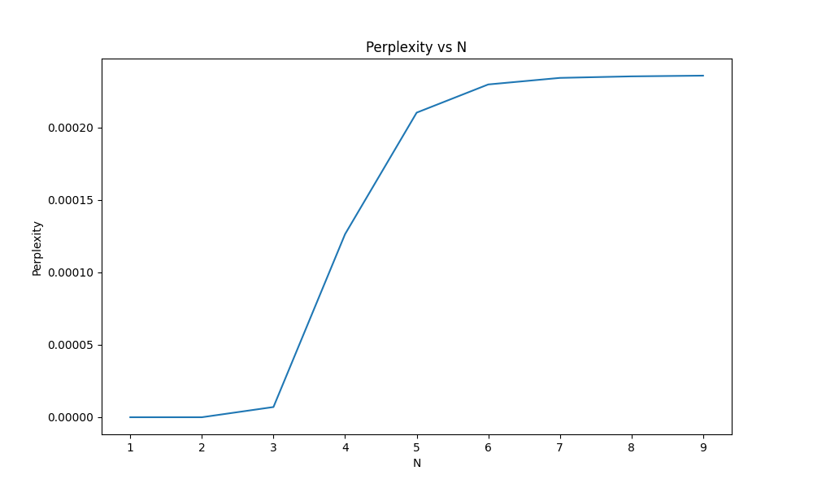

```{r setup, include=FALSE}
knitr::opts_chunk$set(echo = TRUE)
library(ggplot2)
```

# Introducción

Este trabajo implementa un modelo de lenguaje basado en n-gramas, entrenado con scripts de la serie Friends. El objetivo es generar texto nuevo que mantenga características del corpus original, analizando la calidad y coherencia de los resultados obtenidos con diferentes configuraciones del modelo.


\newpage


# Corpus y Preprocesamiento

1. Conseguir y limpiar un corpus de textos

Para el trabajo se eligieron dos corpus, ambos de series Sitcoms. El primero es el corpus de la serie Seinfeld (https://github.com/luonglearnstocode/Seinfeld-text-corpus), y el segundo es el corpus de la serie Friends (https://www.kaggle.com/datasets/blessondensil294/friends-tv-series-screenplay-script). Ambos corpus fueron limpiados de caracteres especiales y se les aplicó un preprocesamiento específico para scripts, que incluye:

## Corpus de Seinfeld

El corpus de Seinfeld contiene los guiones de los episodios de la serie. Es un solo archivo de texto que contiene los diálogos de todos los episodios, alrededor de 65.000 líneas. Aunque contiene algunas separaciones por episodio, no es un corpus estructurado jerárquicamente.

Para la experimentación del punto 3.1 se requirió mas textos para n-gramas de orden superior, por lo que se decidió utilizar el corpus de Friends.

## Corpus de Friends

El corpus de Friends contiene los guiones de todos los episodios de la serie. Por cada episodio de cada temporada se contiene un archivo de texto con la estructura de guión de la serie. Cada archivo contiene los diálogos de los personajes, separados por líneas y con marcadores de inicio y fin de episodio, escena y línea de diálogo.

## Preprocesamiento y Tokenización

El modelo implementa un preprocesamiento específico para scripts, que incluye:

1. **Tokens Especiales**:
   - `<e>`, `</e>`: Marcadores de inicio y fin de episodio
   - `<s>`, `</s>`: Marcadores de inicio y fin de escena
   - `<l>`, `</l>`: Marcadores de líneas de diálogo

En el caso del corpus de Seinfeld, solo se utilizó el marcador de fin de línea de diálogo `</l>` por cada linea del corpus.

Este preprocesamiento nos permite:
- Mantener la estructura jerárquica del script (episodios → escenas → diálogos)
- Generar texto que respeta el formato de guión
- Capturar patrones de inicio y fin de escenas/episodios
- Preservar el contexto conversacional entre personajes


# Implementación del Modelo N-gramas

El modelo implementa tres funcionalidades principales:

## 1. Construcción del Modelo

El proceso de construcción del modelo incluye:

## 2. Predicción y Generación

El modelo puede generar texto a diferentes niveles:

- a) Generación de líneas individuales
- b) Generación de escenas
- c) Generación de episodios completos

## 3. Control de Generación

El modelo incluye varios parámetros para controlar la generación:

- **Temperature**: Controla la aleatoriedad de la generación
  - T < 1: Más determinístico, selecciona palabras más probables
  - T > 1: Más aleatorio, aumenta la probabilidad de palabras menos comunes

- **Límites de longitud**:
  - `max_length`: Longitud máxima de líneas individuales
  - `max_sentences`: Número máximo de líneas por escena
  - `max_scenes`: Número máximo de escenas por episodio

## Ejemplo de Uso

```python
# Inicializar y entrenar modelo
model = Ngram(n=3)
model.fit(train_corpus)

# Generar una línea de diálogo
new_line = model.generate(context="Joey: Hey", temperature=1)

# Generar una escena
new_scene = model.generate_scene(
    context="[Scene: Central Perk] \n", 
    temperature=0.5, 
    max_sentences=100
)

# Generar un episodio completo
title = "The One with the "
episode = model.generate_episode(
    context=title, 
    temperature=0.4, 
    max_lines_per_scene=100
)
```

\newpage

# Resultados y Análisis

## Calidad de Textos Generados

Analizamos cómo varía la calidad de los textos generados en función del valor de $n$ y la cantidad de datos de entrenamiento.

Por un lado podemos hacer un análisis cualitativo de los textos generados. En general, observamos que para los valores de:

- n=1: Palabras aleatorias sin contexto
- n=2: Pares coherentes pero sin estructura global
- n=3-4: Mejor balance entre coherencia local y estructura
- n>4: Sobreajuste, repite fragmentos exactos

En un análisis cuantitativo, podemos medir la calidad de los textos generados con métricas automáticas como Perplexity o BLEU.





En los gráficos se observa que a medida que aumenta el valor de $n$, la Perplexity crece también. Esto se debe a que el modelo se ajusta demasiado a los datos de entrenamiento, perdiendo capacidad de generalización.

Además podemos ver que a medida que agrandamos la cantidad de datos de entrenamiento, la Perplexity parece aumentar inicialmente y luego disminuir. Esto puede deberse a que con más datos el modelo puede aprender mejor algún patron del lenguaje, pero también aumenta el riesgo de sobreajuste.

## Ejemplos de Textos Generados - Seinfeld

Para diferentes temperaturas generamos textos que comiencen con "jerry" (Seinfeld) para comparar la calidad de los textos generados (n=5).

### **T=0.3**

Texto muy determinístico en el comienzo de los, repite fragmentos exactos. Fijación en la expresión "i don't know". Muy variado a la larga.

-  `i don't know what to do so i put it in a garage.`
-  `i don't know.`
-  `you know i don't get you seinfeld. you want something one day. the next day you don't have to do this! this guy is waiting in my house.`
-  `i don't know what to do. so i just stood there like - remember how quayle looked when benson gave him that kennedy line? that's what i looked like.`
-  `i don't know.`

### **T=0.5**

Texto más variado, pero sigue repitiendo fragmentos como "i don't".

-  `george, here's the book. don't let anybody see it. don't let anything happen to it.`
-  `i don't understand it. i haven't read the manual. ooh!" you get my drift.`
-  `i don't know and i didn't want to talk to you. goodbye.`
-  `what's the matter?`
-  `oh, i don't know. i can't think of any solution,` 
`unless of course they should meet with some unfortunate accident. what do you think of this shirt?`

### **T=1.0**

Texto más parecido al corpus

-  `all right, look, we're late. thank you very much...`
-  `ah, you're better off. now you can just let it go.`
-  `you think you can handle that, numb nuts?`
-  `ah..........`
-  `would you?`

### Generación de Guión Generando Lineas de Dialogo

Un caso de uso curioso es generar varias lineas de dialogo y encadenarlas. En el caso de Seinfeld, por la naturaleza del programa de televisión, algunos ejemplos de generaciones podrían pasar por dialogo extraído de una escena del estilo de la serie.

```
postal worker danny: why start now?
jerry: you don't understand, i haven't been together with rachel for like three weeks. 
first i was on the road, then my parents show up, i'm getting a little uncomfortable 
jerry: hi. can i use your place? i got a bunch of friends coming over this weekend.
george: yeah my parents have it. sometimes it skips a generation.
salesman: (angry) all you people with hair think you're so damn superior! 
you have no idea how sick i am of running around town looking for socks.
```

Cuando comparamos esto con lineas del corpus, pudimos hallar las siguientes:

- `POSTAL WORKER DANNY: Why start now?`
- `JERRY: You don't understand, I haven't been together with Rachel for like three weeks. First I was on the road, then my parents show up, I'm getting a little uh backed up.`
- `GEORGE: Yeah my parents have it. Sometimes it skips a generation.`
- `SALESMAN: (angry) All you people with hair think you're so damn superior!` 
`You have no idea what it's like. You ever look down in the bottom of your tub and see a fist` `fulla hair? How'd you like to start your day with that?! (looks ready to punch Jerry)`

En algunos casos se repitió gran parte de una linea del corpus, sin embargo aquellas partes que no son repetidas parecieran tener coherencia en la misma linea. Y por esto mencionado de la forma de dialogo en la serie, las lineas juntas podrían ser un dialogo de la serie en sí. 

## Ejemplos de Textos Generados - Friends

Cuando repetimos el mismo experimento con el corpus de Friends, observamos resultados similares.

### **T=0.3**

Texto muy determinístico, repite fragmentos exactos, exactamente igual que en Seinfeld dos veces figura "i don't know". Otras dos veces figura "oh my god". La frase "sitting on the couch" se repite 3 veces textual en una de las generaciones. Cuando diverge del n-grama mas probable, varía mucho la generación.

-  `well, i was hoping after tonight that maybe i could you know…`
-  `i don't know, but uh, did you guys wrestle?`
-  `oh my god, you’re right! i am too late; they’re sitting on the couch and ross is sitting on the couch and ross is sitting on the couch a`
-  `oh my god, it's all so elegant! when's the dirty stuff starting?`
-  `i don't know, but i.. look, even if she shoots me down, at least i won't spend the rest of my life with you.`

### **T=0.5**

Texto más variado nuevamente, en este caso pasa a repetir "all right".
-  `all right.`
-  `all right, i guess i'll have my stuff packed up.`
-  `well, i was thinking that maybe we could go on a date with jean-claude van damme. can you beat up that guy?`
-  `so you're ruling out surrogacy?`
-  `yeah, i know exactly what i’m talking about.`

### **T=1.0**

Texto más parecido al corpus.
-  `wow, that’s in like 20 minutes. you’d better get dressed.`
-  `it was, yeah. i kind of don't want it to be amazing.`
-  `yeah. listen uh, i’d prefer it if you didn’t call me joey. since i don’t know anyone here, i thought it’d be cool to try out a cool work nick`
-  `you call that delicious?`
-  `uh well yeah, that was the plan, but by the time i was 31!`

En el caso del corpus de Friends, lo que podemos realizar es escribir escenas completas.

## Ejemplo de Escena Generada - Friends

Podemos comenzar una escena por ejemplo con "[Scene: Central", y el modelo completará la escena.

```
    [Scene: Central perk, chandler and monica are sitting on the couch as rachel enters.]
    chandler: no, you keep the old ones in the back, that is so sweet! 
    oh, i can’t believe it! make the presents! make the presents!
    rachel: you know what i don't have?
    monica: the fuzzy little mints at the bottom of the page. 
    then again, maybe it isn't and it's just ridiculous, 
    and it's like, it's like, all of a sudden my roommate, rachel.
    rachel: oh my god! that is our friend! (monica covers her eyes in shock.)
    monica: oh my god, what the hell is in that first kiss.
    rachel: oh my god.
    joey: oh yeah, no no no...that's great!
    ross: well, i guess i could break down your door.
```

A pesar de tener algo de "forma", las oraciones son generadas independiente por lo que no tienen sentido en conjunto.

### Ejemplo de Episodio Completo Generado - Friends

Adjuntamos en el anexo un ejemplo de episodio completo generado por el modelo, comenzando con el título "The One with the", como suelen nombrarse los episodios de Friends. Al igual que lo observado en las escenas, las líneas de diálogo generadas no tienen coherencia entre sí, y la trama del episodio entre las escenas es incoherente también.

## Análisis del Grado de Creatividad e Inteligencia

### Grado de Creatividad

El modelo exhibe un grado de creatividad fundamentalmente limitado y superficial, que podemos analizar en tres niveles diferentes:

1. **Creatividad Combinatoria**
Es capaz de generar nuevas combinaciones de frases y expresiones que no existen exactamente en el corpus original. Por ejemplo, puede crear diálogos entre personajes que nunca ocurrieron en la serie, como interacciones entre Joey y Phoebe que mantienen sus personalidades características pero en situaciones nuevas. Sin embargo, estas combinaciones son puramente estadísticas, basadas en la frecuencia de aparición de patrones en el corpus de entrenamiento. En términos de creatividad combinatoria, el modelo alcanza un grado medio de desempeño. 

2. **Creatividad Estructural**
Si bien puede reproducir la estructura básica de un guión de Friends, con sus marcadores de escena y diálogos, no es capaz de crear nuevas estructuras narrativas. El modelo está confinado a los patrones estructurales presentes en el corpus de entrenamiento, sin poder innovar en la forma de contar historias o presentar diálogos. Esto se evidencia en cómo tiende a caer en patrones repetitivos y estructuras conversacionales predecibles. La creatividad estructural del modelo es baja.

3. **Creatividad Conceptual**
No puede generar ideas o conceptos verdaderamente nuevos, ni crear tramas originales coherentes. Aunque puede reproducir el estilo humorístico de Friends, no comprende realmente el humor que está generando. Es particularmente notable cómo el modelo puede reproducir chistes o situaciones cómicas similares a las del corpus, pero no puede crear humor original que requiera comprensión contextual o timing. En cuanto a la creatividad conceptual, el modelo muestra un grado muy bajo.

### Grado de Inteligencia

La "inteligencia" del modelo se manifiesta de manera desigual en diferentes aspectos:

1. **Inteligencia Lingüística**
Demuestra competencia en el manejo de la estructura básica del lenguaje y es particularmente efectivo en reproducir el estilo conversacional característico de Friends. Sin embargo, esta competencia es superficial: el modelo no comprende realmente el significado de lo que genera, como se evidencia en las frecuentes contradicciones semánticas y la falta de coherencia en conversaciones extensas. En este ámbito podríamos decir que el modelo alcanza un grado medio-bajo. 

2. **Inteligencia Narrativa**
No puede mantener coherencia en historias largas ni establecer relaciones causales lógicas entre eventos. Un ejemplo claro es cómo el modelo puede comenzar una escena con una premisa específica pero rápidamente pierde el hilo narrativo, derivando en diálogos inconexos o contradictorios. La incapacidad de planificar el desarrollo de una trama demuestra las limitaciones fundamentales del enfoque basado en n-gramas. Para este caso el modelo tiene un grado muy bajo.

3. **Inteligencia Social**
Puede reproducir interacciones sociales básicas y mantener ciertos aspectos de las personalidades de los personajes, como el sarcasmo de Chandler o la ingenuidad de Joey. Sin embargo, no comprende realmente las relaciones entre los personajes ni puede generar interacciones que reflejen un entendimiento profundo de sus dinámicas sociales. Para este caso el modelo tiene un grado bajo.

### Conclusión sobre Creatividad e Inteligencia

El análisis de este modelo n-grama revela las limitaciones fundamentales de los enfoques puramente estadísticos para generar lenguaje. Si bien puede producir texto que superficialmente parece creativo e inteligente, un análisis más profundo revela que carece de las características fundamentales que definen la verdadera creatividad e inteligencia humana.

La aparente creatividad del modelo es en realidad un producto de la recombinación estadística de patrones existentes. No puede generar ideas verdaderamente nuevas ni comprender el significado más profundo de lo que produce. De manera similar, su "inteligencia" se limita a reconocer y reproducir patrones, sin verdadera comprensión o capacidad de razonamiento.

Estas limitaciones subrayan la diferencia fundamental entre la capacidad de procesar y recombinar información existente, y la verdadera creatividad e inteligencia que implican comprensión, intencionalidad y capacidad de innovación. El modelo n-grama, aunque impresionante en su capacidad de imitar ciertos aspectos del lenguaje humano, permanece fundamentalmente como una herramienta estadística sofisticada, lejos de alcanzar niveles de creatividad e inteligencia comparables a los humanos.
